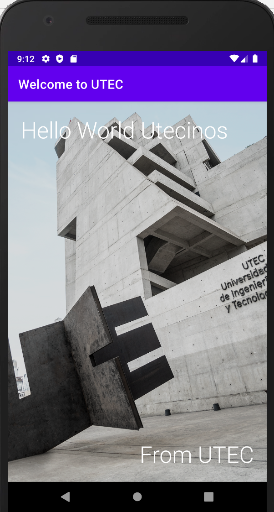

# laboratorio_2

<i>Segundo Laboratorio del curso DBP Sección 1.01</i>

### Primera Pregunta

Crear una aplicación simple de bienvenida a la UTEC.

La aplicacion tiene que verse algo asi:

Es una tarjeta de bienvenida digital que puede ser compartida
con sus amigos.

Requisitos:
<ol>
  <li><b>Nombre: </b> Welcome Card</li>
  <li><b>Nombre del paquete: </b> com.utec.<b>nickname</b>.welcomecard</li>
  <li>Donde nickname es: primera letra del primer nombre + primer apellido. Ejemplo: mabisrror</li>
  <li><b>Lenguaje: </b> Java</li>
  <li><b>SDK minimo: </b> API 23 - Android 6.0 (Marshmallow)</li>
  <li>Tienen que seleccionar las vistas</li>
  <li>Posicionar las vistas</li>
  <li>Agregar estilos como colores fonts, etc</li>
</ol>

### Segunda Pregunta

Crear una aplicación Web que satisfaga los siguientes requerimientos:
<ol>
  <li>Crear los modelos personas y mascotas. Adicionalmente, establecer las relaciones entre los modelos</li>
  <li>Debes tener un formulario de insercion de personas.</li>
  <li>Debes tener un formulario de insercion de mascotas.</li>
  <li>El formulario personas debe tener los siguientes campos como placeholder:
    <ul>Nombres</ul>
    <ul>Apellidos</ul>
    <ul>Sexo</ul>
  </li>
  <li>El formulario mascotas debe tener los siguientes campos como placeholder:
    <ul>Nombre</ul>
    <ul>Duenho</ul>
    <ul>Sexo</ul>
  </li>
  <li>La data debe ser guardada en una base de datos relacional postgres con el nombre <b>dbpdb</b></li>
  <li>La comunicacion entre el cliente y el servidor debe ser de forma asincrona.</li>
</ol>

### Consideraciones

<ol>
  <li>Clonar el proyecto en sus computadora.</li>
  <li>Crear carpetas para cada pregunta: pregunta1, pregunta2</li>
  <li>Dentro de cada carpeta colocar los proyectos.</li>
</ol>

Buena Suerte!
